## *The Good, the Bad,  the Open plan*

### Creating environments for creative teams

### *Joe Wright*
#### __@joe_jag__

---

> *Build projects around motivated individuals. Give them the* environment *and support they need, and trust them to get the job done.*
--5th priniciple of the Agile Manifesto

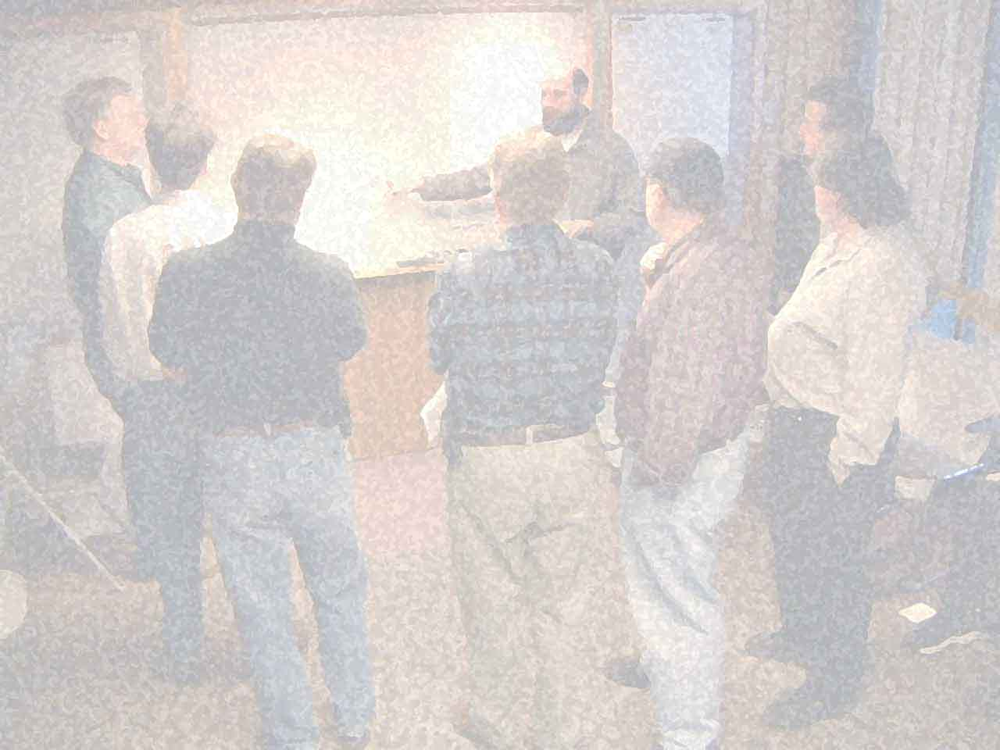

---
<!--

 __________
< Part one >
 ----------
        \   ^__^
         \  (oo)\_______
            (__)\       )\/\
                ||----w |
                ||     ||

-->

---

> for the intellectual work, separate rooms are necessary so that a person who works with their head may not be interrupted
--Sir Charles Trevelyan - UK government report (1854)

---

> but for the more mechanical work, the working in concert of a number of clerks in the same room under proper superintendence, is the proper mode of meeting it
--Sir Charles Trevelyan - UK government report (1854)

---

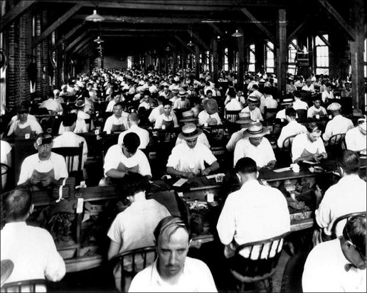

---

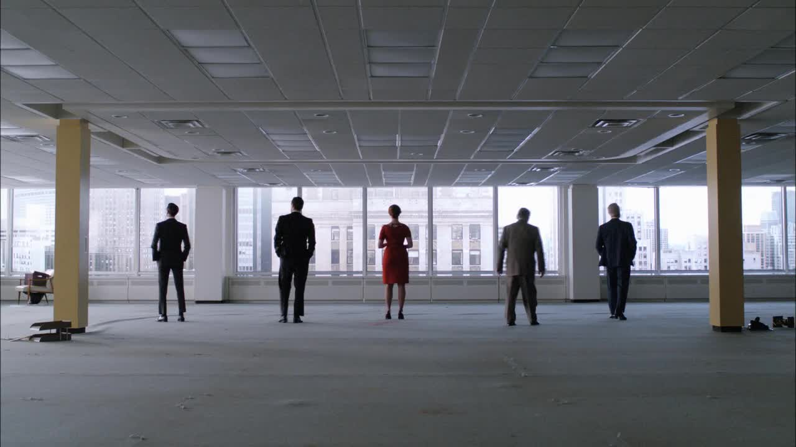

---

---

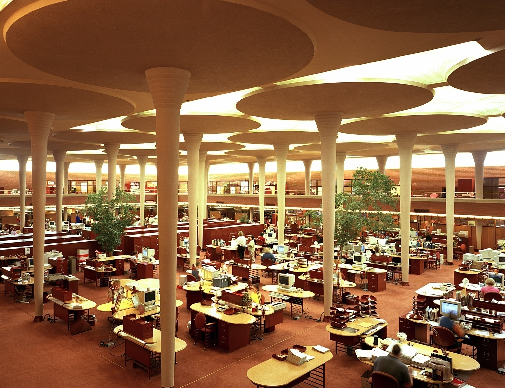

---

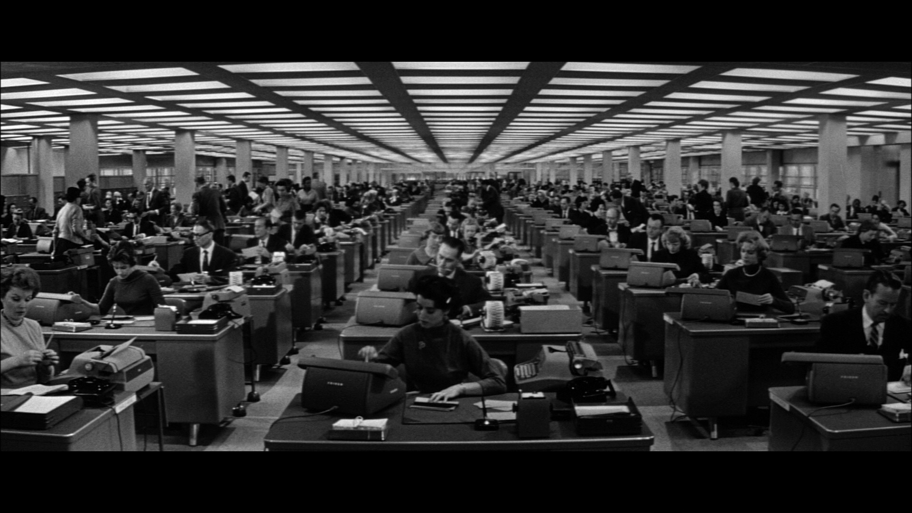

---

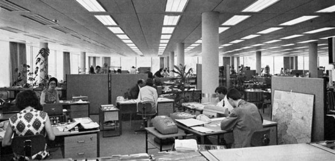

---

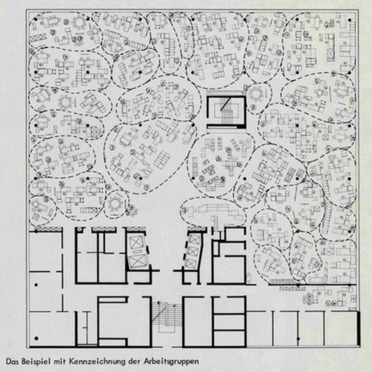

---

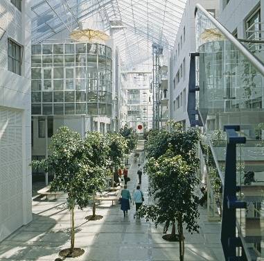

---

---

# Research found

* People sit all day, and that isn’t healthy.
* Most people need places for both private and collaborative work.

---

# Offices need to have

* Flexible ingredients, with ability rearrange based on office needs.
* Height adjustable, sit-to-stand desks (health through better blood flow).
* Dedicated areas for focus, with ability to still see surroundings.

---

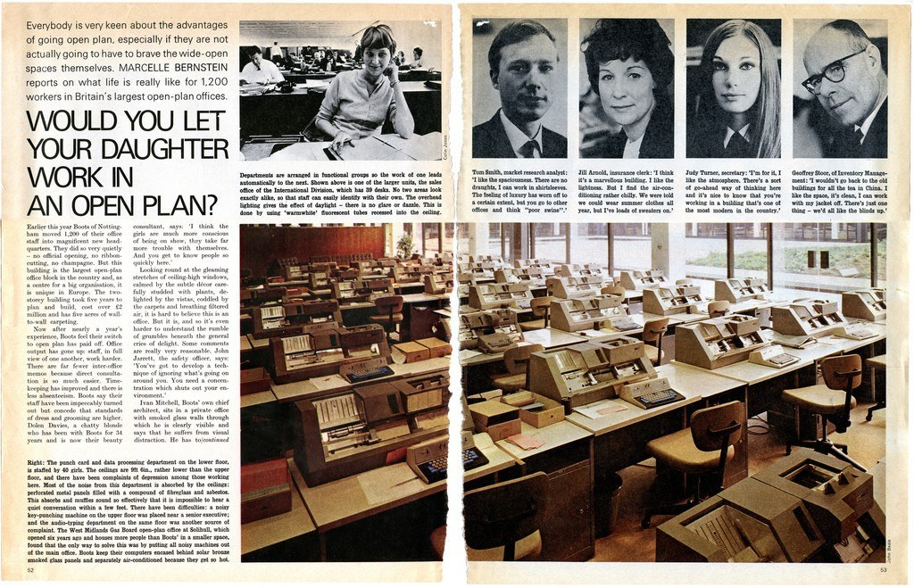

---

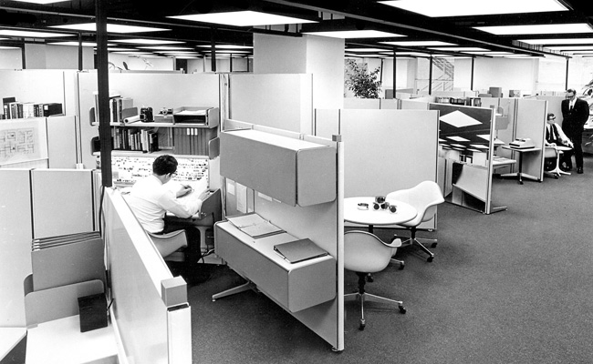

---

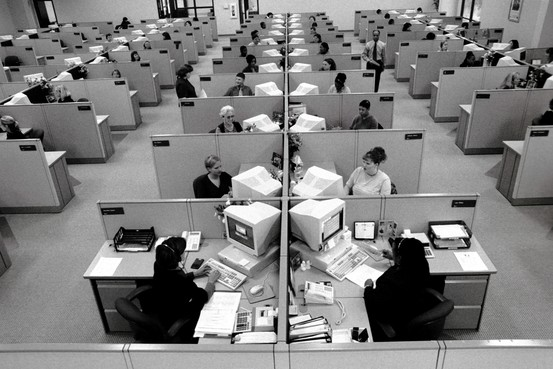

---

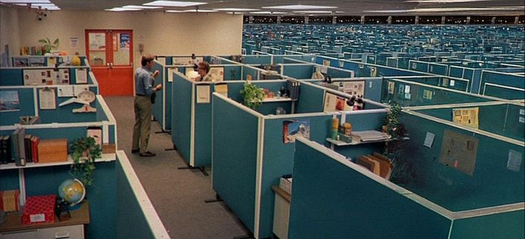

---

> The cubiclizing of people in modern corporations is monolithic insanity
--Robert Prost

---

> not all organisations are intelligent. Lots are run by crass people who can take the same kind of equipment and create hellholes. They make little bitty cubicles and stuff people in them. Barren, rat-hole places
--Robert Prost

---

---

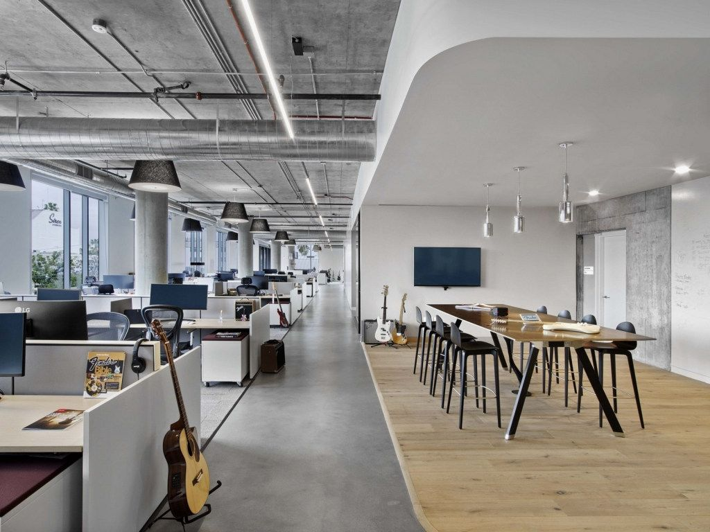

---

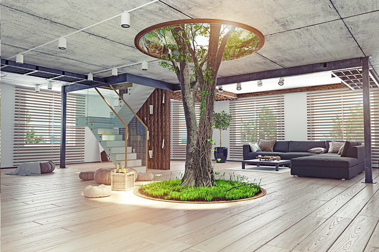

---

---

---

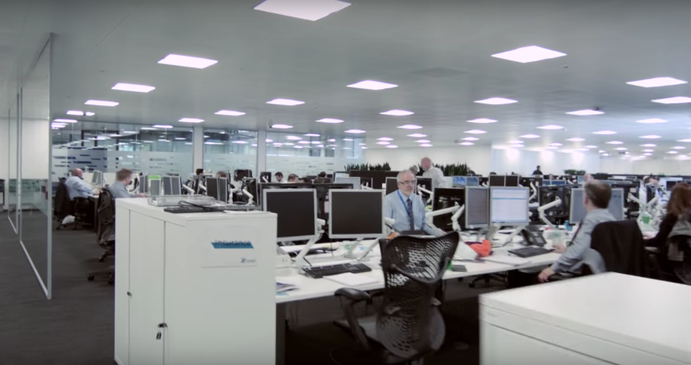

---

<!--

 __________
< Part Two >
 ----------
        \   ^__^
         \  (oo)\_______
            (__)\       )\/\
                ||----w |
                ||     ||

-->

# What are your questions?

### __@joe_jag__ - *Joe Wright*
#### https://github.com/joejag/timebandits
