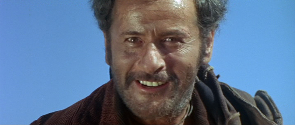
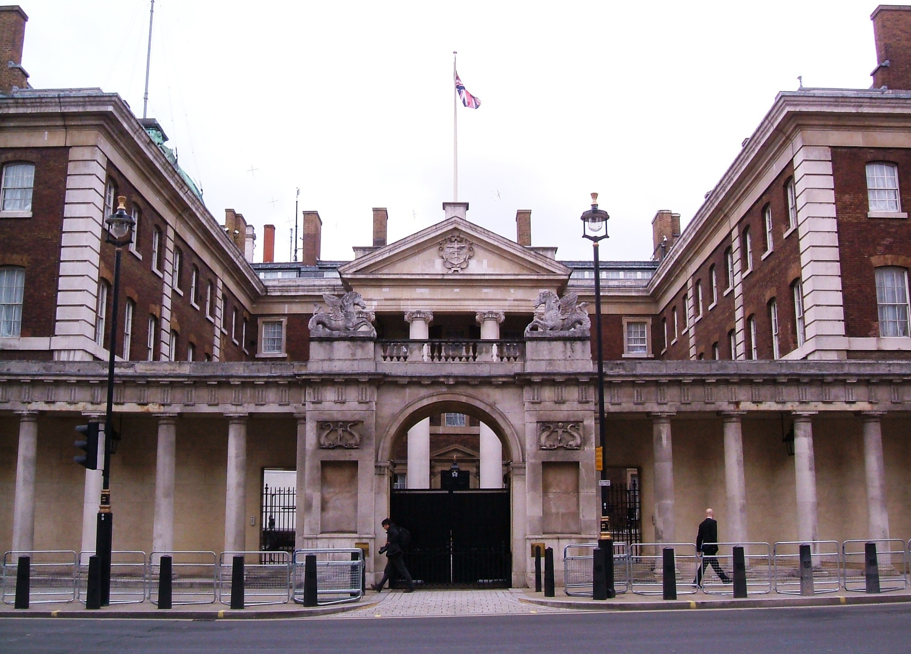

## *The Good, the Bad,  the Open plan*

### Creating environments for creative teams

### *Joe Wright*
#### __@joe_jag__

---

> *Build projects around motivated individuals. Give them the* environment *and support they need, and trust them to get the job done.*
--5th priniciple of the Agile Manifesto

---

---

> for the intellectual work, separate rooms are necessary so that a person who works with their head may not be interrupted
--Sir Charles Trevelyan - UK government report (1854)

---

> but for the more mechanical work, the working in concert of a number of clerks in the same room under proper superintendence, is the proper mode of meeting it
--Sir Charles Trevelyan - UK government report (1854)

---

---

---

---

# What are your questions?

### __@joe_jag__ - *Joe Wright*
#### https://github.com/joejag/timebandits
