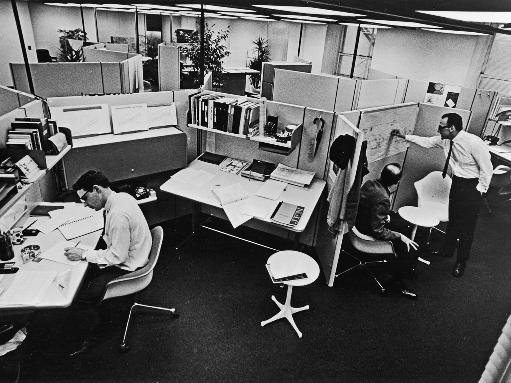

## *The Good, the Bad,  the Open plan*

### Creating environments for collaborative knowledge work

### *Joe Wright*
#### __@joe_jag__

---

> *Build projects around motivated individuals. Give them the* environment *and support they need, and trust them to get the job done.*
--5th principle of the Agile Manifesto

---
<!--

 __________
< Part one >
 ----------
        \   ^__^
         \  (oo)\_______
            (__)\       )\/\
                ||----w |
                ||     ||

-->

---

> for the intellectual work, separate rooms are necessary so that a person who works with their head may not be interrupted
--Sir Charles Trevelyan - UK government report (1854)

---

> but for the more mechanical work, the working in concert of a number of clerks in the same room under proper superintendence, is the proper mode of meeting it
--Sir Charles Trevelyan - UK government report (1854)

---

---

---

---

---

---

## Burolandschaft

---

---

---

---

# Research found

* People sit all day, and that isn’t healthy.
* Most people need places for both private and collaborative work.

---

# Offices need to have

* Flexible ingredients, with ability rearrange based on office needs.
* Height adjustable, sit-to-stand desks (health through better blood flow).
* Dedicated areas for focus, with ability to still see surroundings.

---

---

---

---

---

> The cubiclizing of people in modern corporations is monolithic insanity
--Robert Propst

---

> not all organisations are intelligent. Lots are run by crass people who can take the same kind of equipment and create hellholes. They make little bitty cubicles and stuff people in them. Barren, rat-hole places
--Robert Propst

---

---

---

---

---

---

---

---

<!--

 __________
< Part Two >
 ----------
        \   ^__^
         \  (oo)\_______
            (__)\       )\/\
                ||----w |
                ||     ||

-->

---

# Open Office Benefits

 Communication ✅ 
 Collaboration ✅
 Equality ✅
 Health ✅
 Cost ✅

---

# Communication

### People sitting all together will have more chances to communicate

---

---

* 73% less time spent in face-to-face interactions
* 67% more email and instant message interactions

---

# Open Office Benefits

~~Communication~~ ❌
 Collaboration ✅
 Equality ✅
 Health ✅
 Cost ✅

---

# Collaboration

### Working together to complete  a goal

---

### Matthew Davis (2011)

Helped:

 + a symbolic sense of organizational mission

Hurt:

 - attention spans, creative thinking,  and satisfaction. 

---

# Collaboration?

* Over 60% wear headphones in  open-plan environment
* Anxious to look busy
* Hotdesking disrupts teams working together

---

### A test of your working environment

## Do you have to go to a room to have an impromptu  team meeting?

---

# Open Office Benefits

 ~~Communication~~ ❌
 ~~Collaboration~~ ❌
 Equality ✅
 Health ✅
 Cost ✅

---

# Equality

### Removing the hierarchy of offices

---

> *felt exposed in certain situations, for example if they had some bad news and felt emotional.*
--Anglia Ruskin University (2018)

---

>  *I have been struggling with one particular male employee who stares at me seemingly without any concern for discretion*
> *I strategize alternate routes to the restroom so I don’t have to pass his desk*
--Lauren T

---

> *It sounds ridiculous but because everyone was always staring at me as they walked by, I felt obligated to maintain a more formal posture all the time*
-- Veronica G

---

> *makes me self-conscious about my choice of clothing, and distracts me from what I __should__ be concentrating on at work.*
--Anon 

---

---

# Open Office Benefits

 ~~Communication~~ ❌
 ~~Collaboration~~ ❌
 ~~Equality~~ 🌦
 Health ✅
 Cost ✅

---

# Health

### It's healthier than sitting isolated all-day

---

# It's true!

## __20->32% more active__

### Occupational & Environmental Medicine (2018)

---

## Danish Ministry of Employment (2013)

### Occupants in open-plan offices (more than six people) had 62% more days of sickness absence*

---

# Potential reasons

__(speculation)__

* higher noise exposure in the open-plan office
* more likely to be exposed to viruses
* Lack of privacy causes problems and sickness
* Reduced autonomy, leading to higher stress levels

---

# Open Office Benefits

 ~~Communication~~ ❌
 ~~Collaboration~~ ❌
 ~~Equality~~ 🌦
 ~~Health~~ 🌦
 Cost ✅

---

# Cost

### Real estate is a cost you can reduce

---

---

# Open Office Benefits

 ~~Communication~~ ❌
 ~~Collaboration~~ ❌
 ~~Equality~~ 🌦
 ~~Health~~ 🌦
 Cost ✅

---

<!--

 ____________
< Part three >
 ------------
        \   ^__^
         \  (oo)\_______
            (__)\       )\/\
                ||----w |
                ||     ||

-->

# Open and shut case?

---

---

---

---

---

> Sometimes the workspace we built 10 days ago is no longer the right workspace, so we change it.
--Lisamarie Babik (Menlo)

---

> "I think the physical space is critical... I think the space enables the cultural change."
-- Rich Sheridan (Menlo)

---

---

---

---

<!--

 __________
< Part four >
 ----------
        \   ^__^
         \  (oo)\_______
            (__)\       )\/\
                ||----w |
                ||     ||

-->

# We can do so much better

---

# Three modes of work

### for collaborative knowledge work

---

# The Cave

* 1 or 2 people
* For concentration and privacy
* Enclosed, small, desk and two chairs

---

# The Theatre

* Subset of team
* For explicit and incidental knowledge sharing
* Enclosed, large desk, seats 8 for laptops

---

# The Lounge

* Relax and socialise
* For informal work
* Sofa, bookcase, coffee machine

---

# Putting it together

* For a team of 8
* 2 Caves (for solo/pair work)
* 1 Theatre (for subset teamwork)
* 1 Lounge (for informal activities)

---

---

# Fixing an  open plan

---

# Noise

* Think Burolandschaft
* Remove a bank of desks to make space
* Put up acoustic walls
* Use plants as a wall
* Consider adding 'pink noise'

---

# Create caves

* Allow solo work
* Allow pairs to work

---

# Use Adaptable furniture

* Above all, keep it adaptable
* Use tables with casters
* Consider having power sockets above the desks

---

---

---

# Org Leaders

* Use cultural anthropologists
* Realise reducing space per employee comes at a high cost

---

# Team leaders

* Ask to redesign your area. Add noise barriers
* Steal a room

---

# Individuals

* Influence your leaders.
* Offer solutions
* Use the examples of other companies

---

---

##~~office space~~   ↓
# __employee space__

---

# What are your questions?

### __@joe_jag__ - *Joe Wright*
#### https://github.com/joejag/the\_good\_the\_bad\_the\_openplan
